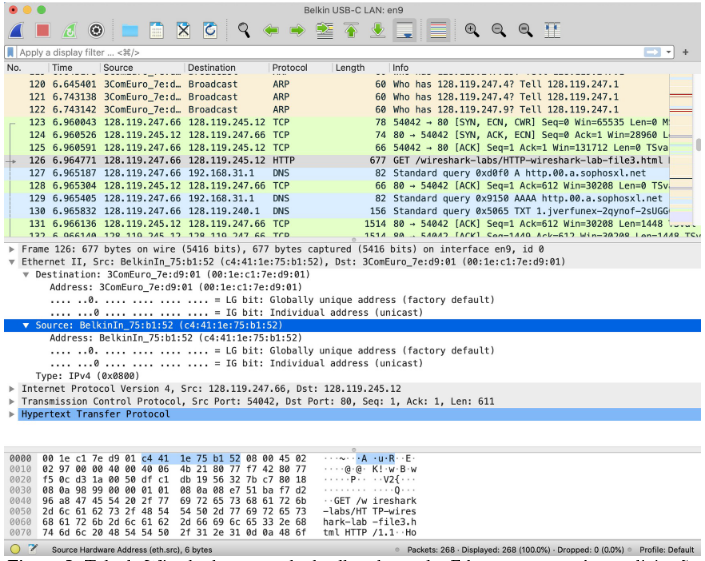
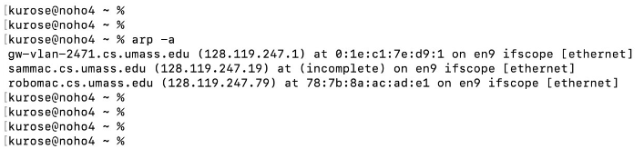
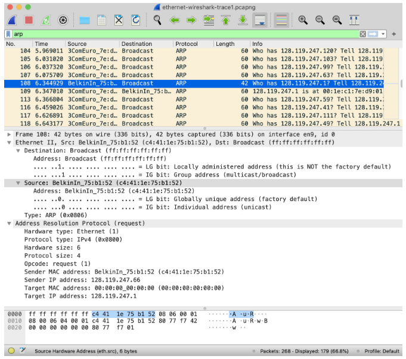

1) Captura de Tráfego Ethernet
    - Certifique-se de que o cache do seu navegador esteja vazio.
    - Inicie o Wireshark
    - Insira o seguinte URL em seu navegador: http://gaia.cs.umass.edu/wireshark-labs/HTTP-wireshark-file3.html.
    - Pare a captura de pacotes do Wireshark.

Encontre o número do pacote (a coluna mais à esquerda na janela superior do Wireshark) da mensagem HTTP GET que foi enviada do seu computador para o gaia.cs.umass.edu, bem como o início da mensagem de resposta HTTP enviada ao seu computador pelo gaia.cs.umass.edu. Você deve ver uma tela parecida com a seguinte (em que o pacote 126 contém a mensagem HTTP GET)


**Figura 1**: Exibição do Wireshark mostrando a mensagem HTTP GET para
http://gaia.cs.umass.edu/wireshark-labs/HTTP-wireshark-file3.html

2. Análise dos Quadros Ethernet
    - Certifique-se de ter selecionado um quadro Ethernet que contém uma mensagem HTTP GET.
    - Na janela de detalhes do pacote, expanda a seção "Ethernet II".
    - Observe que o conteúdo do quadro Ethernet (cabeçalho e carga útil) é exibido na janela de conteúdo do pacote. Sua exibição deve ser semelhante à mostrada na Figura 2.


**Figura 2**: Tela do Wireshark mostrando detalhes do quadro Ethernet que contém a solicitação HTTP GET.

**Responda:**
- a) Qual é o endereço Ethernet de origem (Source)?
R: Meu dispositivo (5c:b2:6d:65\:ab:d5)

- b) Qual é o endereço Ethernet de destino (Destination)?
R: b4:b5:2f:e4:e2:c0

- c) O endereço de destino é o endereço Ethernet de gaia.cs.umass.edu? Se não, a qual dispositivo ele pertence?
R: Não, o endereço é do gateway da rede local

- d) Qual é o valor hexadecimal do campo "Type"? A qual protocolo de camada superior ele corresponde?
R: 0x0800, representa ao protocolo IPv4

3. Localização de Dados na Camada de Aplicação
    - Continue no mesmo quadro Ethernet.
    - Expanda as seções "Internet Protocol Version 4" e "Transmission Control Protocol".
    - Localize a string "GET" (início de uma requisição HTTP).

**Responda:**
- a) Quantos bytes desde o início do quadro Ethernet aparece o "G" de "GET"?
R: 66 bytes

4. Análise da Resposta HTTP
    - Localize um quadro Ethernet que contenha uma resposta HTTP (e.g., "HTTP/1.1 200 OK").
    - Na janela de detalhes do pacote, expanda a seção "Ethernet II".


**Responda:**
- a) Qual é o endereço Ethernet de origem?
R: b4:b5:2f:e4:e2:c0
- b) Qual é o endereço Ethernet de destino?
R: 5c:b2:6d:65\:ab:d5
- c) Quantos bytes desde o início do quadro Ethernet aparece o "O" de "OK"?
R: 78 bytes
- d) Quantos quadros Ethernet transportam dados que fazem parte da mensagem de resposta HTTP completa?
R: 361 bytes

5. Verificação do Cache ARP

Lembre-se de que o protocolo ARP normalmente mantém um cache de pares de conversão de endereços IP para Ethernet em seu computador. O comando arp (em DOS, MacOS e Linux) é usado para visualizar e manipular o conteúdo deste cache. Como o comando arp e o protocolo ARP têm o mesmo nome, é compreensivelmente fácil confundi-los. Mas lembre-se de que eles são diferentes - o comando arp é usado para visualizar e manipular o conteúdo do cache ARP, enquanto o protocolo ARP define o formato e o significado das mensagens enviadas e recebidas e define as ações tomadas na transmissão e recebimento de mensagens ARP.

Vamos dar uma olhada no conteúdo do cache ARP em seu computador. No DOS, MacOS e Linux, o comando "arp -a" exibirá o conteúdo do cache ARP em seu computador. Portanto, em uma linha de comando, digite "arp -a". Os resultados da digitação desse comando em um dos computadores dos autores são mostrados na Figura 3.


**Figura 3**: Executando o comando "arp -a" a partir de um dos computadores dos autores

Faça o seguinte:
    - Abra o prompt de comando (Windows) ou terminal (Linux/macOS).
    - Execute o comando arp -a (Windows) ou arp -an (Linux/macOS).

**Responda:**
- a) Quais são os endereços IP e MAC listados no cache ARP do seu computador?
R: _gateway, que é o MAC do gateway da rede, e outros computadores locais
- b) Qual o significado de cada coluna?
R:
    1. coluna é o endereço de rede (IP) do registro
    2. Endereço físico do hardware (MAC)
    3. Identificador do tipo de hardware (ethernet)
    4. Identificador da NIC (iniciando com e = ethernet, iniciando com w = wireless)

6) Análise das Mensagens ARP
Para observar seu computador enviando e recebendo mensagens ARP, precisaremos limpar o cache ARP, caso contrário, é provável que seu computador encontre um par de conversão de endereço IP-Ethernet necessário em seu cache e, onsequentemente, não precise enviar uma mensagem ARP. O comando "arp –d -a" limpará seu cache ARP usando a linha de comando. Para executar este comando em uma máquina Mac ou Linux, você precisará de privilégios de root ou usar sudo. Se você não tiver privilégios de root e não puder executar o Wireshark em um computador Windows,ignore a parte da coleta de rastreamento deste laboratório e use o arquivo de rastreamento ethernet-wireshark-trace1 discutido anteriormente.
    - Limpeza do Cache ARP
    - Execute o comando:
        ```c:\ arp -d -a``` (Windows) ou
        ```sudo arp -d -a``` (Linux/macOS)
        para limpar o cache ARP.
Captura de Tráfego ARP
    - Inicie o Wireshark e filtre os pacotes ARP digitando "arp" na barra de filtro e pressionando Enter.
    - Insira o seguinte URL em seu navegador: http://gaia.cs.umass.edu/wireshark-labs/HTTP-wireshark-file3.html.
    - Pare a captura de pacotes do Wireshark.
Novamente, não estamos interessados em protocolos IP ou de camada superior, então vamos apenas olhar para os pacotes ARP. Sua exibição deve ser semelhante à mostrada na Figura 3 (observe que inserimos "arp" na janela do filtro de exibição na parte superior da tela do Wireshark).

Análise da Requisição ARP
    - Selecione o primeiro pacote ARP (Request).
    - Na janela de detalhes do pacote, expanda a seção "Address Resolution Protocol".
**Responda:**
- a) Qual é o valor hexadecimal do endereço de origem no quadro Ethernet que contém a requisição ARP?
R: MAC do meu dispositivo (00:d0:59:a9:3d:68)
- b) Qual é o valor hexadecimal do endereço de destino no quadro Ethernet que contém a requisição ARP? Qual dispositivo corresponde a esse endereço?
R: ff:ff:ff:ff:ff:ff, é utilizado para representar uma requisição broadcast, onde a requisição irá se propagar por toda a rede local
- c) Qual é o valor hexadecimal do campo "Type" do quadro Ethernet?
R: 0x0806, representa o tipo ARP
- d) Quantos bytes desde o início do quadro Ethernet começa o campo "Opcode" do ARP?
R: 20 bytes
- e) Qual é o valor do campo "Opcode"?
R: 0x0001, representa o tipo "request"
- f) A mensagem ARP contém o endereço IP do remetente? Se sim, qual é esse valor?
R: Sim, aparece no corpo da requisição ARP (192.168.1.105)
- g) Qual é o endereço IP do dispositivo cujo endereço Ethernet está sendo solicitado na mensagem ARP?
R: 192.168.1.1


**Figura 4**: Uma consulta ARP sendo transmitida do computador de um dos autores

Agora vamos nos aprofundar um pouco mais nas próprias mensagens ARP. Para responder a essa pergunta, você precisará se aprofundar no ARP. O RFC original (https://datatracker.ietf.org/doc/html/rfc826) que define o ARP é um pouco difícil de ler. A entrada da Wikipedia para ARP é muito boa: https://en.wikipedia.org/wiki/Address_Resolution_Protocol

7) Análise da Resposta ARP
    - Localize a resposta ARP (Reply) correspondente à requisição anterior.
    - Na janela de detalhes do pacote, expanda a seção "Address Resolution Protocol".

**Responda:**
- a) Qual é o valor do campo "Opcode"?
R: 0x0002, representa o tipo "response"
- b) Qual é o endereço Ethernet correspondente ao endereço IP especificado na mensagem de requisição ARP?
R: 00:06:25:da:af:73
8) Investigação de Requisições ARP sem Resposta
- Observe outras requisições ARP no rastreamento.

**Responda:**
- a) Por que não há respostas ARP correspondentes a essas requisições?
R: Porque o IP não está sendo utilizado por nenhum dispositivo, então como o modelo de funcionamento é "Não é comigo, não respondo", ninguém responde a requisição, sinalizando que o IP não foi alocado por ninguém.